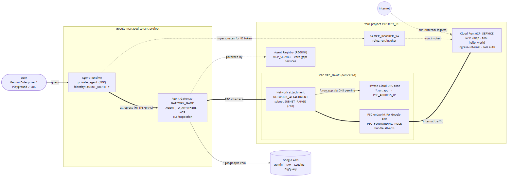
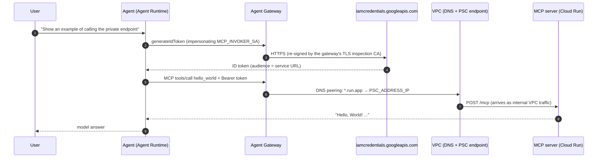

# Architecture

An ADK agent running on **Agent Runtime** (Agent Engine) with **Agent Identity** calls a **private MCP server** on Cloud Run (internal ingress, IAM auth) without leaving Google's network. All of the agent's egress goes through a Google-managed **Agent Gateway** that connects to a dedicated VPC through a Private Service Connect (PSC) interface.

Names in `UPPER_CASE` are variables from [`config.env`](../config.env.example).

Source: [`architecture.mmd`](architecture.mmd). Regenerate with `npx -y @mermaid-js/mermaid-cli@11 -i architecture.mmd -o architecture.png -b white -s 2`.

## Request flow

## Components

### Agent (`agent/private_agent`)

| Aspect | Detail |
|---|---|
| Framework | Google ADK, served by `adk api_server --a2a` in the image `adk deploy agent_engine` builds |
| Identity | `identity_type: AGENT_IDENTITY`: the agent gets its own IAM principal `principal://agents.global.org-<ORG_ID>.system.id.goog/resources/aiplatform/projects/<PROJECT_NUMBER>/locations/<REGION>/reasoningEngines/<ID>` (read from `spec.effectiveIdentity`) |
| Egress | `agent_gateway_config.agent_to_anywhere_config.agent_gateway = projects/PROJECT_ID/locations/REGION/agentGateways/GATEWAY_NAME` |
| Private tool | [`McpToolset`](../agent/private_agent/private_mcp_toolset.py) to `PRIVATE_MCP_BASE_URL/mcp`, with an ID token minted by impersonating `MCP_INVOKER_SA` |
| Optional tool | `BigQueryToolset` with the **end user's** OAuth token (Gemini Enterprise authorization `BQ_AUTH_ID`), read-only unless `BQ_ALLOW_WRITES=true` |

`.env` and `.agent_engine_config.json` are **generated** by `scripts/04-deploy-agent.sh`. `adk deploy` passes them to the deployment: the JSON goes into `AgentEngineConfig`, and `.env` becomes the environment variables.

### Agent Gateway (`GATEWAY_NAME`)

| Field | Value |
|---|---|
| Type | Google-managed, `governedAccessPath: AGENT_TO_ANYWHERE` (egress) |
| Protocols | `MCP`: the gateway governs MCP traffic, so private destinations must be MCP servers |
| Registry | `//agentregistry.googleapis.com/projects/PROJECT_ID/locations/REGION` (regional; the multi-region `us` rejects service creation) |
| `networkConfig.egress.networkAttachment` | `NETWORK_ATTACHMENT` |
| `networkConfig.dnsPeeringConfig` | `domains: [run.app.]`, target network `VPC_NAME` |
| Service agent | `service-<PROJECT_NUMBER>@gcp-sa-agentgateway.iam.gserviceaccount.com` |

The YAML the script imports is written to `.state/gateway.yaml`. The field names follow the real API schema shipped with gcloud (`lib/googlecloudsdk/schemas/networkservices/v1/AgentGateway*.yaml`), which differs from some published examples (for example, `domains` is a list and `protocols` is required).

### MCP server (`mcp-server/`)

FastMCP (`mcp==1.30.0`), streamable HTTP at `/mcp`, stateless, with one read-only tool `hello_world(name)`. Deployed with `--ingress=internal --no-allow-unauthenticated`; only `MCP_INVOKER_SA` has `roles/run.invoker`. Registered in Agent Registry with its [`toolspec.json`](../mcp-server/toolspec.json).

## Networking

A **dedicated VPC** keeps the private `run.app.` DNS zone from affecting other workloads: any VPC that resolves `*.run.app` to a PSC endpoint changes how all its clients reach Cloud Run. Cloud Run's internal ingress accepts traffic from **any** VPC in the same project, so the target service needs no VPC configuration of its own.

| Resource | Variable | Notes |
|---|---|---|
| VPC | `VPC_NAME` | custom mode |
| Subnet | `SUBNET_NAME` / `SUBNET_RANGE` | `/28` minimum for one gateway; **Private Google Access on** |
| Network attachment | `NETWORK_ATTACHMENT` | `ACCEPT_AUTOMATIC`; the gateway connects with one IP from the subnet |
| PSC endpoint for Google APIs | `PSC_ADDRESS_NAME` / `PSC_ADDRESS_IP` / `PSC_FORWARDING_RULE` | global internal address (`PRIVATE_SERVICE_CONNECT`), forwarding rule to the `all-apis` bundle |
| Private DNS zone | `DNS_ZONE_NAME` | `run.app.`, visible only in `VPC_NAME`; `A *.run.app. → PSC_ADDRESS_IP` |
| Firewall | — | none needed (implied allow egress) |

How a call reaches the MCP server:

1. The agent's traffic always goes to the gateway (`agentToAnywhereConfig`), **including calls to Gemini and other Google APIs**.
2. The gateway performs **TLS inspection**: it terminates TLS and re-signs with its own CA (`agentGatewayCard.rootCertificates`).
3. For `*.run.app`, the gateway resolves through DNS peering into `VPC_NAME` and gets `PSC_ADDRESS_IP`.
4. Traffic enters the VPC through the PSC interface (network attachment) and reaches the PSC endpoint.
5. Cloud Run sees the request as traffic from a VPC in the same project, which is what `ingress=internal` allows.

> A plain PSC interface on the agent (without the gateway) does **not** work against internal-ingress Cloud Run: it returns 404/403. The PSC endpoint + private DNS is what makes the request count as internal.

The template validates the `*.run.app` path end to end. It does not assert whether other `*.googleapis.com` calls leave the gateway directly or also traverse the VPC.

## Trusting the gateway's TLS inspection CA

Google injects the gateway CA automatically only for source-based deployments. `adk deploy agent_engine` builds **its own Dockerfile**, so the agent counts as bring-your-own-container: without the CA, **every** outbound call fails with `CERTIFICATE_VERIFY_FAILED` (Gemini included).

This template:

1. Fetches `agentGatewayCard.rootCertificates` and appends it to `certifi`'s public roots → `agent/private_agent/certs/ca-bundle.pem`. `adk deploy` copies the package to `/app/agents/private_agent/`.
2. Sets `SSL_CERT_FILE`, `REQUESTS_CA_BUNDLE` and `GRPC_DEFAULT_SSL_ROOTS_FILE_PATH` to that path in `.env`. They must be deployment env vars, not set from Python code: telemetry opens gRPC channels before the agent module is imported.
3. [`__init__.py`](../agent/private_agent/__init__.py) removes those variables when the path doesn't exist, so the same `.env` works for local `adk web`.

Re-run `04-deploy-agent.sh` whenever the gateway is recreated or its CA rotates.

## Identity and IAM

| Principal | Role | On | Why |
|---|---|---|---|
| Gateway service agent | `roles/compute.networkUser` | project | use the network attachment |
| Gateway service agent | `roles/dns.peer` | project | DNS peering into `VPC_NAME` |
| Agent principal | `roles/iam.serviceAccountOpenIdTokenCreator` | `MCP_INVOKER_SA` | mint ID tokens for Cloud Run |
| `MCP_INVOKER_SA` | `roles/run.invoker` | `MCP_SERVICE` | call the MCP server |
| End users (optional) | BigQuery User + Data Viewer/Editor | dataset | BigQuery tools run as the user |

The agent principal is tied to the Reasoning Engine resource. Deploying a **new** agent (instead of updating with `--agent_engine_id`) produces a new principal, and `05-iam.sh` must run again.

## Agent Registry

| Service | Kind | Interfaces |
|---|---|---|
| `MCP_SERVICE` | MCP server (`tool-spec`) | `https://MCP_SERVICE-<PROJECT_NUMBER>.REGION.run.app/mcp` (JSONRPC) |
| `core-gapi-services` | Endpoint (`no-spec`) | Google APIs the agent uses: `REGION-aiplatform`, `aiplatform`, `bigquery`, `logging`, `telemetry`, `cloudtrace`, `monitoring`, `agentregistry`, `secretmanager`, `iamcredentials`, `sts`, `oauth2`, `cloudresourcemanager` |

## Not included (hardening)

- **Gateway authorization policy.** The template registers services but does not configure an authorization extension. To enforce least privilege, add an IAP `authzExtension` in `DRY_RUN`, grant `roles/iap.egressor` to the agent principal on the registry entries, review the logs, then switch to enforced mode. This was not validated as part of this template.
- **A2A agent card.** `adk api_server --a2a` serves A2A endpoints; this template ships no `agent.json`.
